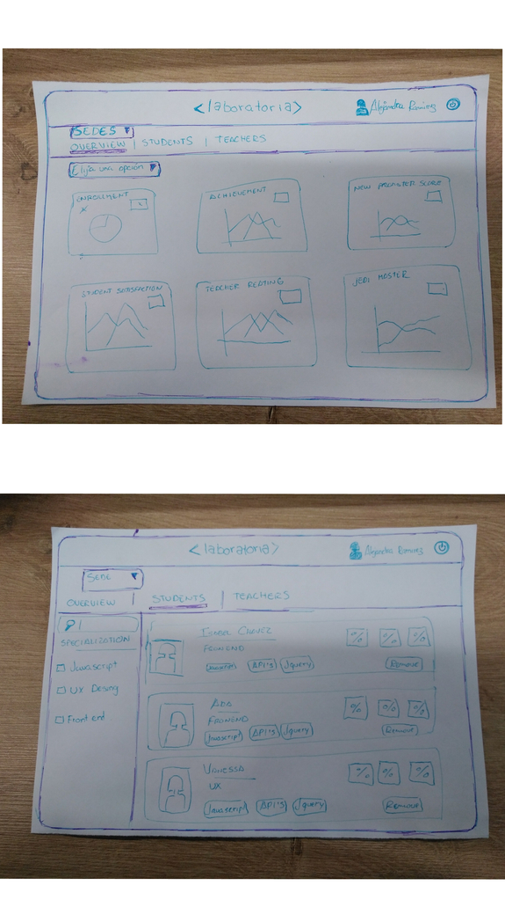

# Data Dashboard

El siguiente producto final con nombre 'Data Dashboard' que presentaremos a continuacion ha sido desarrollado con los conocimientos adquiridos en el transcurso de este bootcamp, en el cual se han cumplidos los siguientos puntos solicitados con el cliente, el cual presentaremos a mas detalle.

* El total de estudiantes presentes por sede y generación.
* El porcentaje de deserción de estudiantes.
* La cantidad de estudiantes que superan la meta de puntos en promedio de todos los sprints cursados. La meta de puntos es 70% del total de puntos en HSE y en tech.
* El porcentaje que representa el dato anterior en relación al total de estudiantes.
* El Net Promoter Score (NPS) promedio de los sprints cursados. 
* La cantidad y el porcentaje que representa el total de estudiantes que superan la meta de puntos técnicos en promedio y por sprint.
* La cantidad y el porcentaje que representa el total de estudiantes que superan la meta de puntos de HSE en promedio y por sprint.
* El porcentaje de estudiantes satisfechas con la experiencia de Laboratoria.
* La puntuación promedio de l@s profesores.
* La puntuación promedio de l@s jedi masters.

## La Entrevista con Nuestro Cliente

Como primer paso, procedimos a realizar nuestro scketch, en el cual representamos el modelo del producto y se lo presentamos a nuestro cliente, con el que conversamos y nos mencionó las necesidades que presentaba. De esta manera pudimos elegir el modelo mas adecuado, el mismo que mostramos a continuacion.

<center></center>

## El Desarrollo del Producto Final.

## El Producto Final
<!-- * **Track:** _Common Core_
* **Curso:** _Creando tu primer sitio web interactivo_
* **Unidad:** _Producto final_

***

## Flujo de trabajo

1. Debes realizar un [**fork**](https://gist.github.com/ivandevp/1de47ae69a5e139a6622d78c882e1f74)
   de este repositorio.

2. Luego deberás **clonar** tu fork en tu máquina. Recuerda que el comando a usar
   es `git clone` y su estructura normalmente se ve así:

   ```bash
   git clone https://github.com/<nombre-de-usuario>/freelancer.git
   ```

3. Cuando hayas terminado tu producto, envía un Pull Request a este repositorio
   (puedes solicitar apoyo de tus profes para este paso).

> Nota: No olvides que es una buena práctica describir tu proyecto en este
> archivo `README.md` y también desplegar tu web a Github Pages :smiley:. -->
